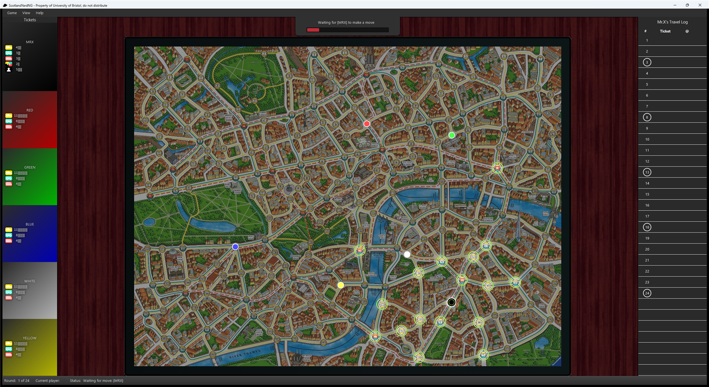

<h1 align="center">Scotland Yard</h1>

<p align="center">
A Java implementation of the Scotland Yard board game, played on the real 199-station
London map. Five detectives hunt Mr X across the city. Mr X moves in secret, surfacing
only on the reveal rounds.
</p>

<p align="center">
  
</p>

## Running it

Requires JDK 17. Maven is not needed, because the wrapper fetches it.

```bash
./mvnw test                            # 85 tests
./mvnw exec:java                       # launch the game
```

On Windows use `mvnw.cmd`. If Maven reports `JAVA_HOME not found`, point it at your JDK:

```powershell
$env:JAVA_HOME = "C:\Program Files\Eclipse Adoptium\jdk-17.0.19.10-hotspot"
```

Note that `exec:java` does not recompile. Run `./mvnw compile` first if you have changed
anything.

## How the game is modelled

The board is a Guava `ImmutableValueGraph<Integer, ImmutableSet<Transport>>`. Stations are
nodes, and each edge carries the set of transports that run along it. A ferry edge can only
be crossed with a secret ticket.

Two classes carry the game logic. Everything else is provided framework.

`MyGameStateFactory` builds a `GameState`, an immutable snapshot of a game in progress. Each
state derives its available moves, its winner and its player set once, in the constructor,
and caches them. `advance(Move)` does not mutate anything, it returns a new state. That
matters for the AI, where a search holds thousands of states at once and calls
`getAvailableMoves()` in its innermost loop.

`MyModelFactory` wraps a `GameState` in an observable `Model`. Observers are notified after
the state has advanced, with `GAME_OVER` in place of `MOVE_MADE` on the final move.

Some rules worth stating, because they are easy to get subtly wrong:

- A secret ticket substitutes for any transport, ferries included, so a secret move exists
  for every edge out of a station.
- A double move spans two rounds. It needs two rounds left in the log, and each leg is
  written to the travel log against its own round, so a double move straddling a reveal
  round is hidden for one leg and revealed for the other. Its second ticket is only
  affordable once the first has been spent.
- A detective hands the ticket it spends to Mr X as it moves. A detective late in a rotation
  can therefore un-strand a Mr X who had no ticket to move with.
- A detective is out of the game once it has no legal move. That is weaker than holding no
  tickets, since it can hold a full hand and still be boxed in by its own teammates. When
  that happens it is skipped and play passes back to Mr X.
- Detectives win by landing on Mr X. Mr X wins by filling the travel log, or by stranding
  every detective. Once anyone has won there are no available moves.

## Layout

```
src/main/java/uk/ac/bris/cs/scotlandyard/
  model/          game logic. MyGameStateFactory and MyModelFactory are the implementation,
                  the rest (Board, Move, Player, ScotlandYard, Ai) is framework
  ui/             JavaFX views and controllers
  ui/ai/          the AI player
src/main/resources/
  graph.txt       the 199-station map, 467 edges
  pos.txt         station coordinates for the board image
src/test/         85 tests. AllTest is the suite the build runs
```

## AI players

`ResourceManager.scanAis()` scans the classpath at startup, so an AI is a drop-in. Any public
class with a no-arg constructor implementing `Ai` is found automatically and offered in the
setup screen.

```java
public interface Ai {
    String name();
    Move pickMove(Board board, Pair<Long, TimeUnit> timeoutPair);
    default void onStart() {}
    default void onTerminate() {}
}
```

Two constraints shape any implementation. `pickMove` runs against the timeout it is handed
and is killed one second after it expires, so a search needs a hard internal deadline. And
`Board` has no `getMrXLocation()`.

That second one is the real problem, and `ui/ai/` is an answer to it.

| Class | Role |
|---|---|
| `MrXLocator` | Infers where Mr X is, for the detective side. |
| `BoardStates` | Rebuilds an advanceable `GameState` from a `Board`. |
| `Distances` | All-pairs hops, precomputed, plus a ticket-aware distance. |
| `Evaluator` | Scores a position from Mr X's point of view. |
| `Search` | Alpha-beta, deepened until the clock runs out. |
| `MyAi` | Ties it together. |

**Finding Mr X.** The travel log names a station only on the reveal rounds, but between them
it still records the kind of ticket he spent, and that is the leak. A taxi ticket can only
have carried him down a taxi edge. So the candidate set is seeded at his last reveal and
expanded once per logged entry, along the edges that ticket could have paid for. Candidates
standing on a detective are pruned, because he would have been caught there. A secret ticket
crosses any edge, so it expands everywhere and tells you nothing, which is what makes it
worth holding.

**Scoring.** Three factors: distance to the detectives, weighted toward the nearest one since
that is what catches you; freedom, meaning how many onward moves the station leaves; and
safety, meaning whether a detective can reach it next move. They multiply rather than add, so
a station that is catastrophic on any single axis is vetoed instead of being averaged back
into respectability. Secret and double tickets carry a price, so Mr X spends them to escape
rather than idly.

**Searching.** Iterative deepening against the real deadline. A ply only replaces the
incumbent move once it has finished, so the search is always safe to interrupt. Detectives
are modelled greedily rather than branched, because every detective moving in every
combination explodes the tree, and depth buys more than an exact reply does.

## Known gaps

The AI compiles, is discovered by the game, and plays. It has no tests of its own, and the
ticket budget in `Distances.ticketAwareDistance` is an approximation, documented in the
Javadoc rather than papered over.
